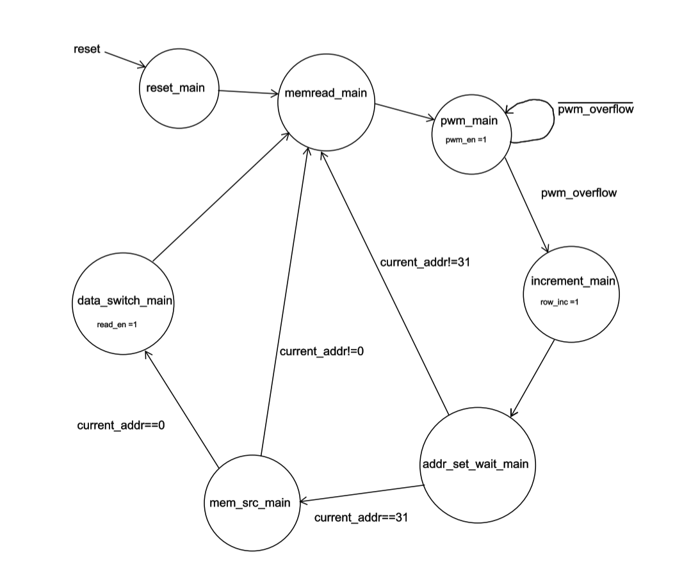
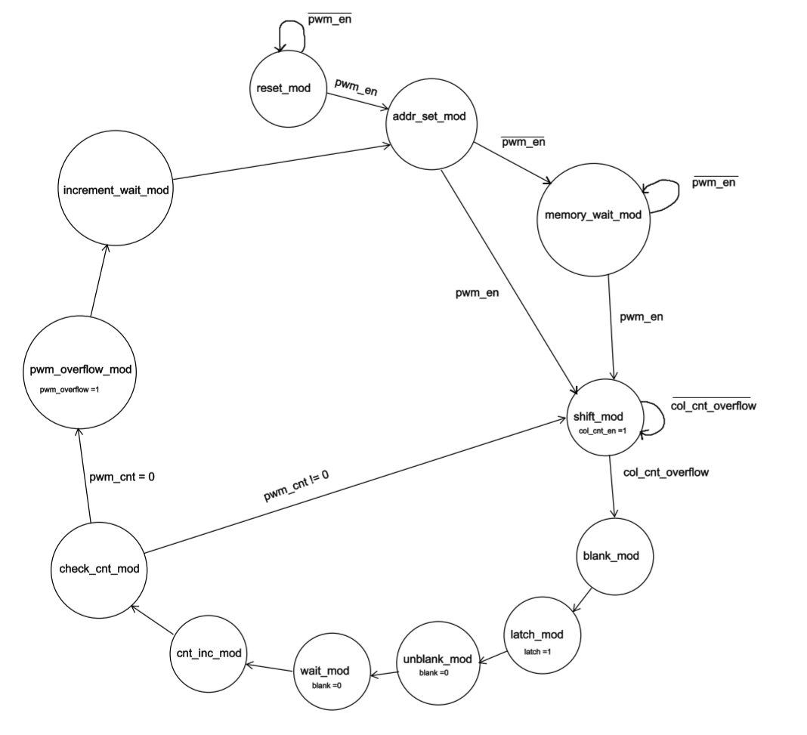
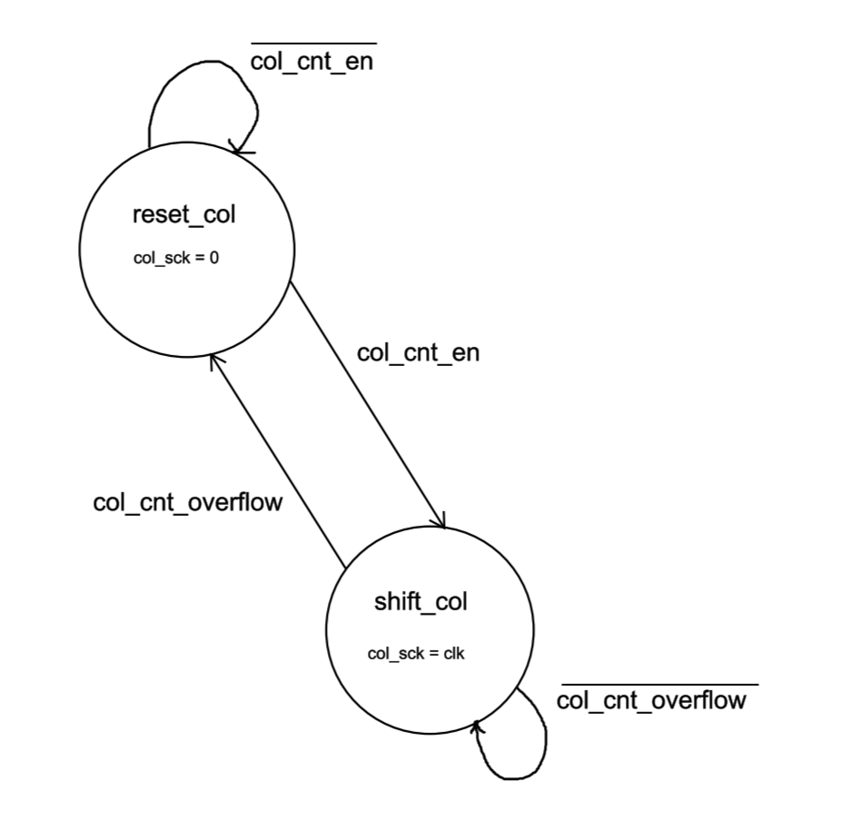

# FPGA Design
The FPGA is composed of an SPI module, a data storage module, and a display module. The SPI module receives data from the microcontroller and sends the data to the data storage module. If the SPI module completes the transaction and the display completes a frame, the data gets stored on flip-flops to be read by the display module.

The display module is composed of a main FSM, a color PWM FSM, a column shift FSM, color mapping combinational logic, and coordinate mapping combinational logic.

The SPI data on the flops first reaches the coordinate mapping combinational logic. This combinational logic assigns pixel values based on the integer value of the SPI data and the current selected rows. This row data is sent to the color mapping combinational logic, where colors are assigned in a gradient based on the selected row and row data. This data is then sent to the Color PWM module, where the output RGB values of each row pixel are assigned using PWM. This row data is then shifted out to the shift registers on the matrix display.

## FPGA Schematics and Block Diagrams
### Top Level Schematics

  

### Display module

  

## FPGA Finite State Machines
### Main FSM

  

### ColorMod FSM

  

### Colshift FSM

  

