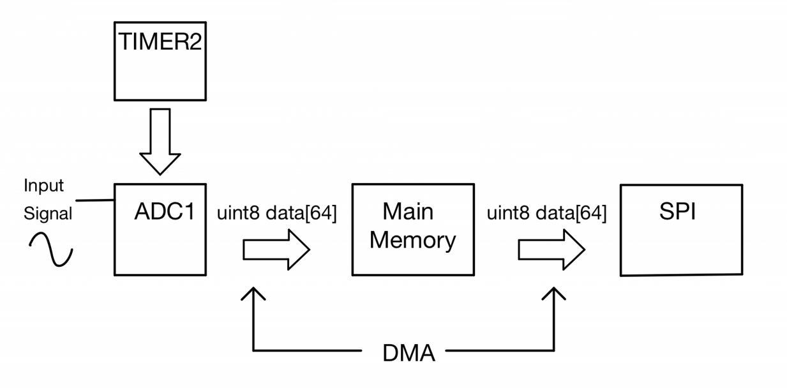

The primary goal of the microcontroller in this project is to convert an analog signal into a digital signal that can be read and processed by the FPGA. This was possible by using one of two onboard ADCs on the STM32L432KC which performed 6 bit resolution conversions per sample. 

## MCU Block Diagram

  

# ADC & TIMER Peripherals
The ADC is configured to take in a single input from a microcontroller pin, which is linked to one of the 18 available ADC channels. Each ADC channel is capable of performing conversions, but since this project is focused on a single input signal, only one ADC channel outputs digitized conversions. In this project, the ADC is configured to complete six bit conversions.

Conversions typically take place when the ADC start conversion register is enabled through software. This enables the user to request conversions at desired and arbitrary times. However to properly display a signal, it is essential to sample at a constant and specific rate that prevents aliasing. To sample at a constant rate, the TIMER peripheral, with interrupts, is configured to trigger a conversion at every overflow event. Additional benefits to this approach is that it gives the user the ability to control the sampling rate of the input signal by simply adjusting the ARR value, which holds the maximum value of the counter. The team included discrete time divisions using six dip switches that can be adjusted by the user to sample signals up to a 100 kHz. 

# DMA & SPI Peripheral
The DMA is used to offload data storage and transmission from the core processor. The DMA takes converted data from the ADC and stores it in the main memory as a byte. After 64 conversions are completed, the DMA then sends the data that is stored in memory over to SPI to be transferred to the FPGA. The team decided on 64 conversions per SPI transaction because the display in use is 64x64 pixels. SPI constantly sends digitized data to the FPGA and from there, the FPGA decides how to display the data.

